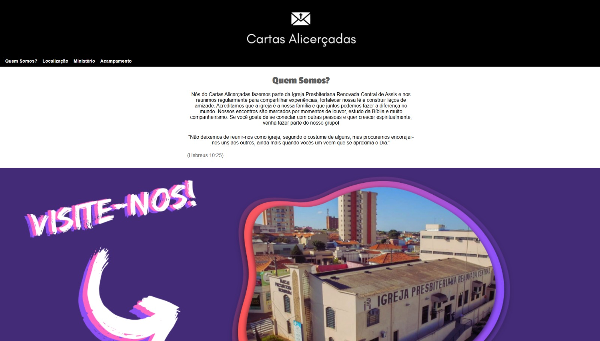

<h1 align="center">Cartas Alicerçadas</h1>

<p align="center">
  Projeto desenvolvido para apresentar o grupo de jovens <strong>Cartas Alicerçadas</strong>, reunindo informações sobre o ministério, localização, atividades e eventos em uma página institucional simples e responsiva.
</p>

<p align="center">
  
  
  
</p>

---

## Demonstração

<p align="center">
  
</p>

<p align="center">
  Interface institucional criada para apresentar o grupo de jovens, com identidade visual própria, navegação simples e seções voltadas às principais informações do ministério.
</p>

---

## Índice

- Sobre o projeto
- Tecnologias utilizadas
- Funcionalidades e seções
- Como executar localmente
- O que esse projeto me ensinou
- Período de desenvolvimento
- Autor

---

## Sobre o projeto

O **Cartas Alicerçadas** foi um dos meus primeiros projetos em desenvolvimento Front-End.

O site surgiu a partir de uma proposta da liderança do grupo de jovens, que buscava uma forma simples de apresentar o ministério para novos visitantes e reunir informações importantes em um único lugar.

A proposta foi desenvolver uma página institucional com conteúdos sobre o grupo, sua localização, atividades e eventos, ao mesmo tempo em que eu colocava em prática meus conhecimentos iniciais de **HTML, CSS e Flexbox**.

Por ter sido desenvolvido no início dos meus estudos, o projeto também teve um papel importante na construção da minha base em desenvolvimento web, principalmente em estruturação de páginas, organização visual e responsividade.

---

## Tecnologias utilizadas

| Tecnologia | Aplicação no projeto |
|---|---|
| **HTML5** | Estruturação das seções e conteúdos da página |
| **CSS3** | Estilização geral da interface |
| **Flexbox** | Organização, alinhamento e distribuição dos elementos |
| **Media Queries** | Adaptação do layout para diferentes tamanhos de tela |

---

## Funcionalidades e seções

O site foi estruturado como uma página institucional com diferentes áreas voltadas à apresentação do grupo:

- Quem somos
- Localização
- Ministério
- Acampamento
- Menu de navegação entre seções
- Banner de apresentação
- Organização de conteúdo institucional
- Layout responsivo
- Distribuição de elementos utilizando Flexbox

---

## Como executar localmente

Por ser um projeto desenvolvido com HTML e CSS puros, não há dependências adicionais para instalar.

```bash
# Clone o repositório
git clone https://github.com/HenriqueYamada/Cartas-Alicercadas.git

# Acesse a pasta do projeto
cd Cartas-Alicercadas

# Abra o arquivo index.html no navegador
```

---

## O que esse projeto me ensinou

O **Cartas Alicerçadas** teve um papel importante na construção da minha base em desenvolvimento Front-End, por ser um dos primeiros projetos em que utilizei HTML e CSS para criar uma solução completa a partir de uma necessidade real.

Um dos principais desafios foi transformar as informações fornecidas pelo grupo em uma página visualmente organizada e fácil de navegar. Durante esse processo, precisei entender melhor como dividir o conteúdo em seções, organizar os elementos e manter uma identidade visual consistente.

Também tive meus primeiros contatos práticos com **responsividade** e com o uso de **Flexbox** para resolver problemas de alinhamento, posicionamento e distribuição de conteúdo.

O projeto também me ajudou a compreender melhor a relação entre estrutura HTML e estilização CSS, além de me dar mais segurança para desenvolver interfaces maiores e mais organizadas posteriormente.

---

## Período de desenvolvimento

**Início:** Dezembro de 2024 / Janeiro de 2025  
**Conclusão:** 24 de janeiro de 2025

O projeto foi desenvolvido como prática independente durante o início da minha jornada em desenvolvimento Front-End.

---

## Autor

Desenvolvido por **Henrique Yuji Yamada**

Você pode acessar o projeto em: https://henriqueyamada.github.io/Cartas-Alicercadas
